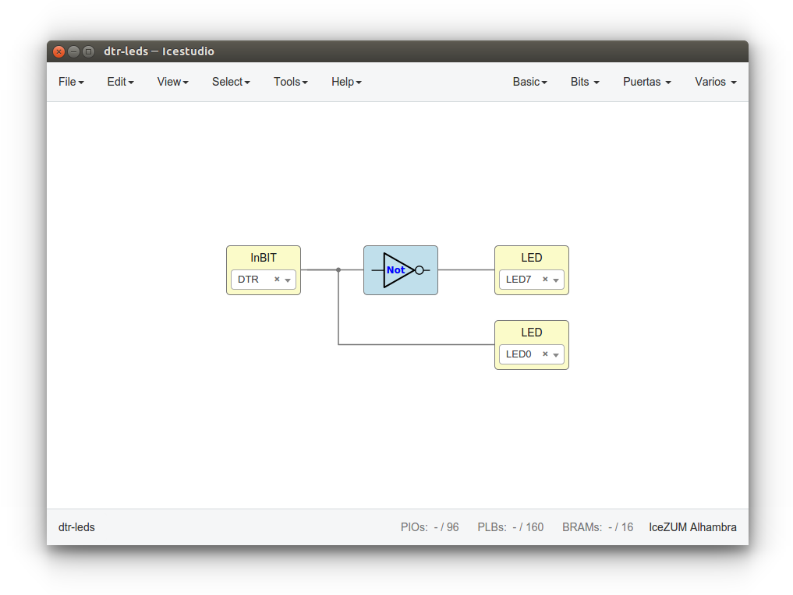

# InBit
A hello world **Electron** and **node.js** application for setting a **bit** on or off from a GUI

## Why?

I wanted to learn a little bit about the **web technologies** for the **Desktop**. As I learn by doing, i decided to program this hello-world simple desktop webapp. I chose [Electron](https://electronjs.org/) because is the tool used for [Atom](https://atom.io/), my main editor. And of course, because all this tools are **Libre-software**

## How it works?

When you turn the **GUI switch** on or off, the **DTR signal** from the **serial port** is changed. Im using it with the [Icezum Alhambra](https://github.com/FPGAwars/icezum/wiki) OpenFPGA board for sending bits from the Desktop to my circuits. Of course, it can also be used with any other **FTDI-based** board. The InBit app just opens a **serial port** and change the **DTR signal** according to the user inputs

The **hello-world** circuit that has been **uploaded** into the board in the above **animation** is the following:

It simply shows the **DTR** and the inverted **DTR signals** on the LEDs 0 and 7 respectively
